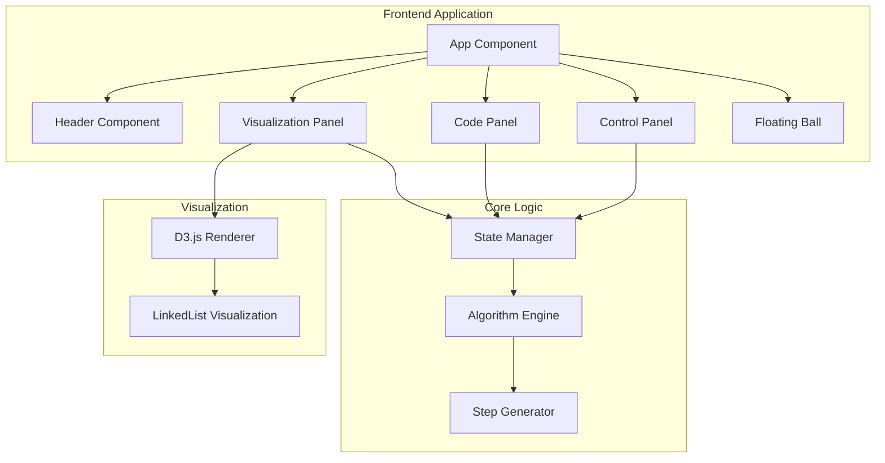

# Design Document

## Overview

本项目是一个 LeetCode 第2题"两数相加"算法可视化应用，采用 TypeScript + React + D3.js 技术栈开发。应用提供类似 IDE Debug 的交互体验，用户可以逐步观察算法执行过程，包括代码高亮、变量值展示、链表图形化等功能。项目部署在 GitHub Pages 上，通过 GitHub Actions 实现自动化部署。

## Architecture



## Components and Interfaces

### 1. App Component
主应用组件，负责整体布局和状态管理。

```typescript
interface AppProps {}

interface AppState {
  currentStep: number;
  steps: AlgorithmStep[];
  isPlaying: boolean;
  playSpeed: number;
}
```

### 2. Header Component
页面头部，包含标题和GitHub链接。

```typescript
interface HeaderProps {
  title: string;
  leetcodeUrl: string;
  githubUrl: string;
}
```

### 3. CodePanel Component
代码展示面板，支持语法高亮和debug效果。

```typescript
interface CodePanelProps {
  code: string;
  currentLine: number;
  variables: VariableState[];
}

interface VariableState {
  name: string;
  value: string;
  line: number;
}
```

### 4. VisualizationPanel Component
链表可视化面板，使用D3.js渲染。

```typescript
interface VisualizationPanelProps {
  l1: ListNode | null;
  l2: ListNode | null;
  result: ListNode | null;
  pointers: PointerState;
  carry: number;
}

interface PointerState {
  l1Position: number;
  l2Position: number;
  pPosition: number;
}
```

### 5. ControlPanel Component
控制面板，包含播放控制按钮。

```typescript
interface ControlPanelProps {
  currentStep: number;
  totalSteps: number;
  isPlaying: boolean;
  onPrevious: () => void;
  onNext: () => void;
  onPlayPause: () => void;
}
```

### 6. FloatingBall Component
悬浮球组件，展示微信交流群二维码。

```typescript
interface FloatingBallProps {
  qrCodeImage: string;
  tooltipText: string;
}
```

### 7. Algorithm Engine
算法执行引擎，生成每一步的状态。

```typescript
interface AlgorithmEngine {
  generateSteps(l1: number[], l2: number[]): AlgorithmStep[];
}

interface AlgorithmStep {
  stepNumber: number;
  codeLine: number;
  description: string;
  variables: VariableState[];
  l1State: ListNodeState | null;
  l2State: ListNodeState | null;
  resultState: ListNodeState | null;
  carry: number;
  pointers: PointerState;
}

interface ListNodeState {
  values: number[];
  currentIndex: number;
}
```

## Data Models

### ListNode
```typescript
class ListNode {
  val: number;
  next: ListNode | null;
  
  constructor(val: number = 0, next: ListNode | null = null) {
    this.val = val;
    this.next = next;
  }
}
```

### AlgorithmStep
```typescript
interface AlgorithmStep {
  stepNumber: number;
  codeLine: number;
  description: string;
  variables: VariableState[];
  l1State: {
    values: number[];
    currentIndex: number;
  } | null;
  l2State: {
    values: number[];
    currentIndex: number;
  } | null;
  resultState: {
    values: number[];
  } | null;
  carry: number;
}
```

### VariableState
```typescript
interface VariableState {
  name: string;
  value: string;
  line: number;
  type: 'pointer' | 'number' | 'node';
}
```

## Correctness Properties

*A property is a characteristic or behavior that should hold true across all valid executions of a system-essentially, a formal statement about what the system should do. Properties serve as the bridge between human-readable specifications and machine-verifiable correctness guarantees.*

### Property 1: Step Navigation Consistency

*For any* current step index and total steps count, when the user navigates to the previous step (if currentStep > 0), the new step should be currentStep - 1; when navigating to the next step (if currentStep < totalSteps - 1), the new step should be currentStep + 1.

**Validates: Requirements 3.1, 3.2**

### Property 2: Play/Pause Toggle Consistency

*For any* isPlaying state (true or false), when the user triggers the play/pause action, the resulting state should be the logical negation of the previous state.

**Validates: Requirements 3.3**

### Property 3: Step-UI Synchronization

*For any* algorithm step, when that step is displayed, the code panel should highlight the line specified in step.codeLine, the variable display should show all variables from step.variables, and the visualization should render the linked list states from step.l1State, step.l2State, and step.resultState.

**Validates: Requirements 2.2, 2.3, 4.2, 4.4, 5.3**

### Property 4: Step Generation Completeness

*For any* input arrays l1 and l2, the generated steps should contain all required fields (stepNumber, codeLine, description, variables, l1State, l2State, resultState, carry), and the sequence of steps should capture every significant state change in the algorithm execution.

**Validates: Requirements 5.1, 5.2**

### Property 5: Node Rendering Consistency

*For any* linked list node in the visualization, the rendered element should display the node's value and include a visual arrow pointing to the next node (or null indicator if no next node).

**Validates: Requirements 4.3**

### Property 6: Carry Display Correctness

*For any* algorithm step where carry > 0, the visualization should prominently display the carry value; when carry === 0, the carry display should either be hidden or show 0.

**Validates: Requirements 4.5**

### Property 7: Input Change Regeneration

*For any* change to the input values (l1 or l2 arrays), the system should regenerate all algorithm steps, and the new steps should correctly reflect the computation for the new inputs.

**Validates: Requirements 5.5**

### Property 8: Responsive Layout Constraint

*For any* viewport size at or above the minimum supported size (1280x720), all UI components (header, code panel, visualization panel, control panel, floating ball) should be visible within the viewport without requiring scrolling.

**Validates: Requirements 8.2**

## Error Handling

### Input Validation
- Empty arrays: Treat as [0] to represent the number 0
- Invalid node values: Clamp values to 0-9 range
- Arrays exceeding maximum length (100): Truncate to first 100 elements

### Runtime Errors
- D3.js rendering failures: Display fallback text representation of linked lists
- Step navigation out of bounds: Clamp to valid range [0, totalSteps - 1]
- Auto-play timer issues: Clear existing timers before creating new ones

### UI Error States
- Image loading failure for QR code: Display placeholder with error message
- Keyboard event conflicts: Prevent default behavior only for registered shortcuts

## Testing Strategy

### Unit Testing Framework
- Use **Vitest** as the testing framework for its fast execution and TypeScript support
- Use **React Testing Library** for component testing
- Use **@testing-library/user-event** for simulating user interactions

### Property-Based Testing Framework
- Use **fast-check** library for property-based testing in TypeScript
- Configure minimum 100 iterations per property test
- Each property test must be tagged with format: `**Feature: leetcode-add-two-numbers-visualizer, Property {number}: {property_text}**`

### Test Categories

#### Unit Tests
1. **Component Rendering Tests**
   - Header renders with correct title and links
   - CodePanel renders code with line numbers
   - ControlPanel renders buttons with shortcut text
   - FloatingBall renders with correct icon and hover behavior

2. **Algorithm Engine Tests**
   - Step generation for simple inputs [2,4,3] + [5,6,4]
   - Step generation for unequal length inputs
   - Step generation with carry propagation

3. **Keyboard Shortcut Tests**
   - Left arrow triggers previous step
   - Right arrow triggers next step
   - Space toggles play/pause

#### Property-Based Tests
1. **Property 1 Test**: Generate random step indices and verify navigation consistency
2. **Property 2 Test**: Generate random boolean states and verify toggle behavior
3. **Property 3 Test**: Generate random steps and verify UI synchronization
4. **Property 4 Test**: Generate random input arrays and verify step completeness
5. **Property 5 Test**: Generate random linked lists and verify node rendering
6. **Property 6 Test**: Generate random carry values and verify display
7. **Property 7 Test**: Generate random input changes and verify regeneration
8. **Property 8 Test**: Generate random viewport sizes and verify layout

#### Integration Tests
1. Full algorithm visualization flow from start to end
2. Keyboard and button control interaction
3. Auto-play functionality with timing

## Project Structure

```
src/
├── components/
│   ├── App.tsx
│   ├── Header.tsx
│   ├── CodePanel.tsx
│   ├── VisualizationPanel.tsx
│   ├── ControlPanel.tsx
│   └── FloatingBall.tsx
├── core/
│   ├── algorithmEngine.ts
│   ├── stepGenerator.ts
│   └── types.ts
├── hooks/
│   ├── useKeyboardShortcuts.ts
│   ├── useAutoPlay.ts
│   └── useAlgorithmState.ts
├── utils/
│   ├── linkedList.ts
│   └── codeHighlight.ts
├── styles/
│   └── index.css
├── assets/
│   └── wechat-qr.png
├── main.tsx
└── index.html
```

## Technology Stack

- **React 18**: UI framework with hooks
- **TypeScript**: Type safety and better developer experience
- **D3.js**: Linked list visualization
- **Vite**: Build tool and development server
- **Prism.js** or **highlight.js**: Code syntax highlighting
- **Vitest**: Unit and property-based testing
- **fast-check**: Property-based testing library
- **ESLint + Prettier**: Code quality and formatting
- **GitHub Actions**: CI/CD for automated deployment

